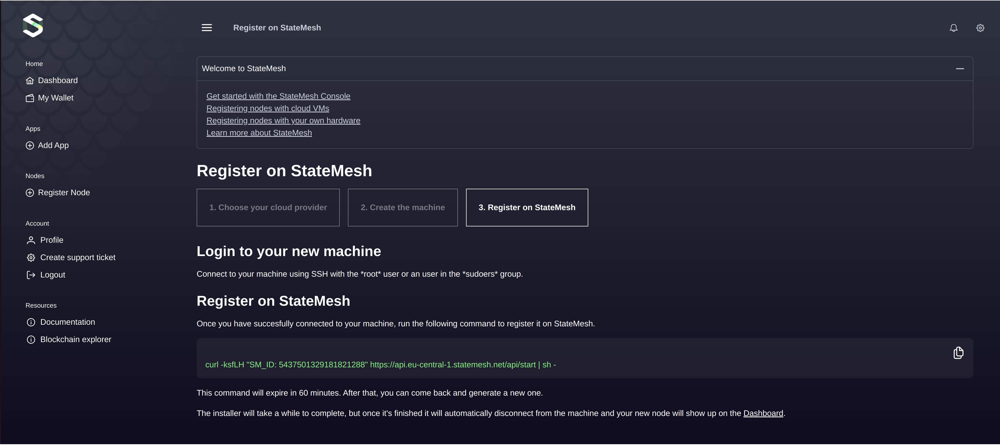
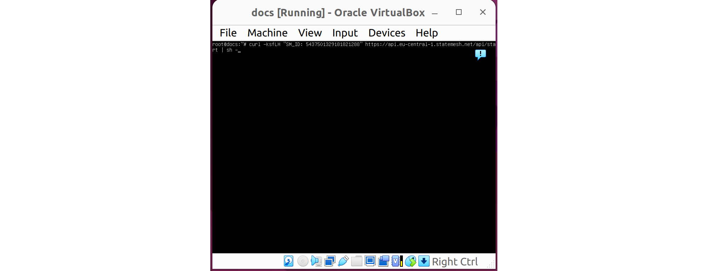
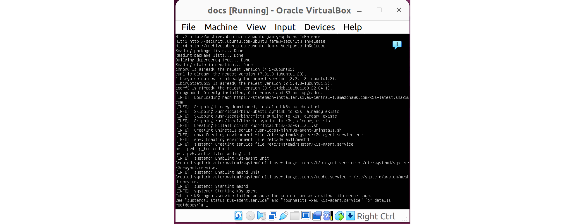
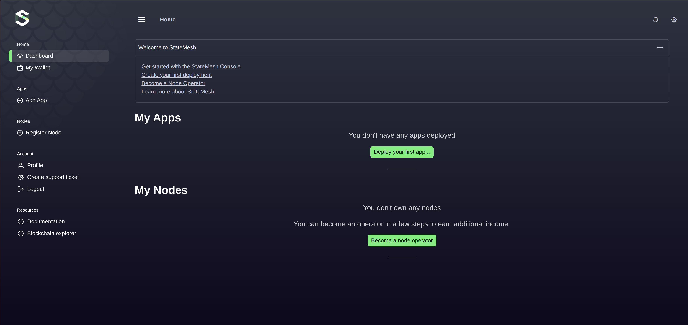

Guide for registering an existing machine as a node in the StateMesh system.

# Registering an Existing Machine

## Step 1: Navigate to Existing Machine Registration

* Navigate to the **"Register Node"** section in the StateMesh interface.

* Select **"An Existing Machine"**.

* You will be redirected directly to Step 3.



## Step 2: Connect and Register the Machine

1. **Prepare Your Existing Machine**:

* Ensure that your existing machine meets the system requirements for StateMesh.

* In this example, we use an Ubuntu Server virtual machine.

2. **Run the Registration Command**:

* Log in to your existing machine via SSH:
```bash
  `ssh root@<PUBLIC_IP>`
```
Replace `<PUBLIC_IP>` with the public IP address of your machine.

* If you are not logged in as the root user, switch to root by running:
```bash
sudo -i
```
* Copy the registration command provided in the StateMesh interface and execute it:
```bash
curl -ksfLH "SM_ID: 8328779677220605192" https://api.eu-central-1.statemesh.net/api/start | sh -
```



3. **Monitor the Installation Process**:

* The command will download and set up the necessary StateMesh components.

* You will see logs similar to the screenshot below:



## Step 3: Verify the Registration on Dashboard

* After the registration command completes, go to the **Dashboard** in the StateMesh interface.

* Confirm that the newly registered existing machine appears as active.



## Key Notes

* The registration command is **time-sensitive** and will expire in 60 minutes. If expired, you can generate a new command in the StateMesh interface.

* Ensure your machine meets the minimum requirements for compatibility with StateMesh.

* During the registration process, do not interrupt the installation command.

 

For detailed configuration instructions, proceed to the [Node Configuration](./node-configuration) guide.
