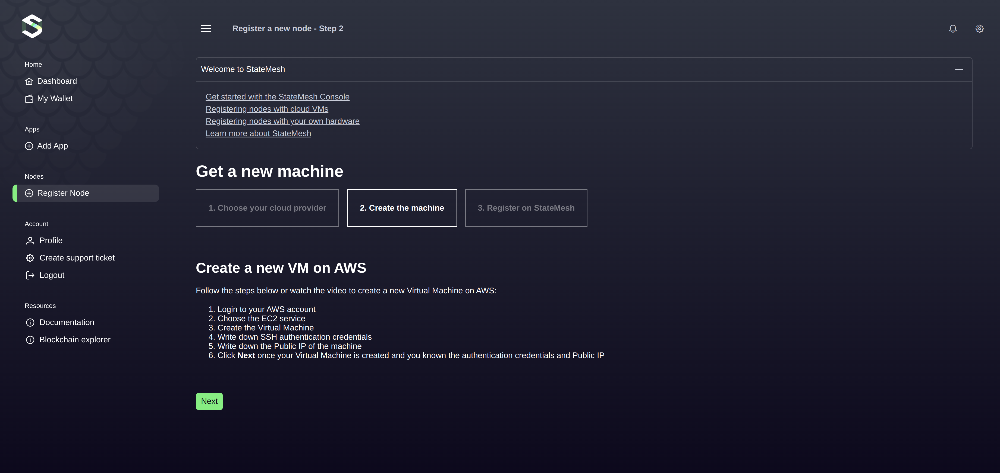
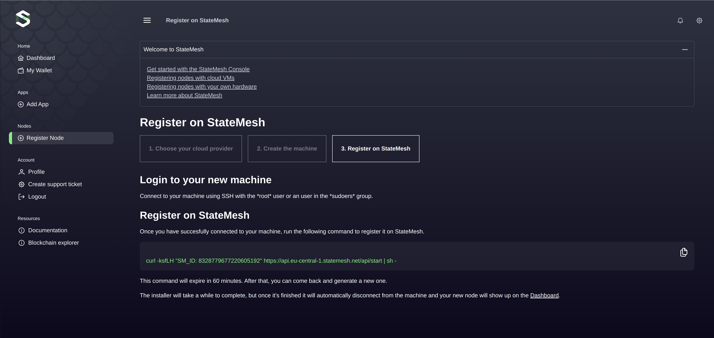

Guide for registering a new machine as a node in the StateMesh system.

# Registering a New Machine

## Overview

This guide explains the process of registering a new machine as a node on StateMesh. Follow the steps below to set up
your node efficiently.

## Step 1: Choose Your Cloud Provider

* Navigate to the **"Register Node"** section in the StateMesh interface.
* Select **"New Machine"**.
* From the list of cloud providers, choose one of the following:
  * **AWS**
  * **GCP (Google Cloud Platform)**
  * **Azure**
  * **Hetzner**
  * **DigitalOcean**


 
## Step 2: Create the Machine
**Example: Creating a Virtual Machine on AWS**
1. Log in to your **AWS account**.
2. Navigate to the **EC2 Service** in the AWS Management Console.
3. Create a new **Virtual Machine (VM)**:
  * Select the desired instance type and configuration.
  * Ensure the machine meets the recommended specifications for StateMesh.
4. Set up **SSH Authentication Credentials**:
  * Generate an SSH key pair if you don’t already have one.
  * Save the private key securely.
5. Note down the **Public IP Address** of your newly created machine.
6. Once the VM is ready, return to the StateMesh interface and click **Next**.




## Step 3: Register the Machine on StateMesh

1. **Connect to the Machine**:

  * Use SSH to connect to your machine:
```bash
  `ssh root@<PUBLIC_IP>`
```
  Replace `<PUBLIC_IP>` with the public IP address of your machine.

2. **Run the Registration Command**:

  * Copy the command provided in the StateMesh interface.

  * Example:
```bash
  curl -ksfLH "SM_ID: 8328779677220605192" https://api.eu-central-1.statemesh.net/api/start | sh -
```
3. **Command Execution**:

  * The command will initiate the installation and registration process.

  * Wait for the installer to complete. Once done, the machine will automatically disconnect.



## Step 4: Verify the Registration

  * Go to the **Dashboard** in the StateMesh interface.

  * Confirm that the newly registered node appears as active.


## Key Notes

  * The registration command is time-sensitive and will expire in 60 minutes. If expired, you can generate a new command in the StateMesh interface.

  * Ensure your machine meets the minimum requirements for compatibility with StateMesh.

  * During the registration process, do not interrupt the installation command.
